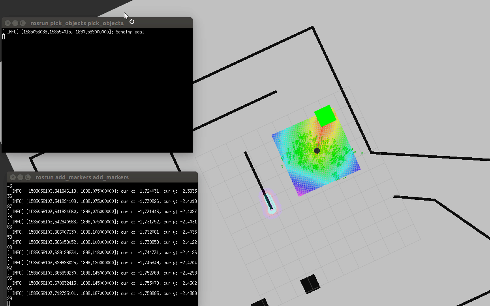

# UD_RoboSW_HomeServiceRobot

## Result

## Installation
    $ mkdir catkin_ws
    $ catkin_make
Run 

	$ ./src/scripts/home_sevices.sh

## Description

This project is the one of the Udacity projects in robotics software engineer course.

